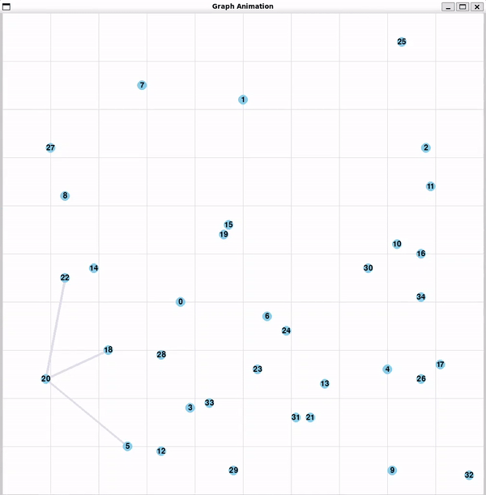
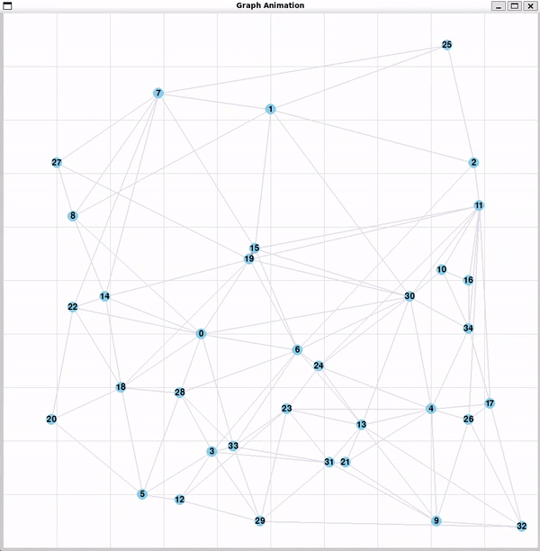
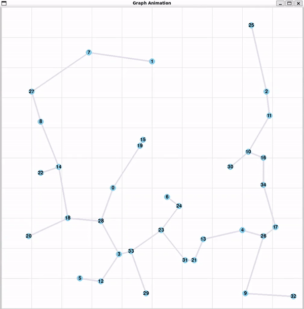

## Prerequisite:
* jsoncpp
* python/pygame (if you want to see the output graph)
## Execution
```
make
make run
```
* If you want to change the number of nodes or other parameters, you can find them in *Util.h*

* To see the process of each step, use following commands:
    ```
    make step1
    make step2
    make step3
    ```
* Generate only the final MRST graph (you can generate MST graph by commenting  mst.rectilinearize() in line 8 of *main.cpp*)
    ```
    make graph
    ```
* Clean output files
    ```
    make clean
    ```
## Result Representation
* ### Step1 Generate sparse spanning graph
    
* ### Step2 Kruskal's Algorithm
    
* ### Step3 Construct MRST
    
